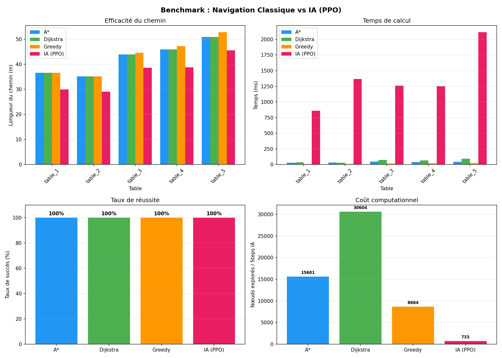

# 🤖 Autonomous Robot Navigation — Restaurant Use Case

Comparative analysis of **classical path planning** (A*, Dijkstra, Greedy + DWA) and **reinforcement learning** (PPO Actor-Critic) for autonomous TurtleBot3 navigation in a simulated restaurant environment.



---

## 📁 Project Structure

```
Robotique/
├── map/                          # Restaurant map
│   ├── worlds/restaurant.world   # Gazebo world file
│   ├── map.pgm                   # Occupancy grid (SLAM)
│   ├── map.yaml                  # Map metadata (resolution, origin)
│   └── scripts/                  # Map generation scripts
│
├── coordonées/
│   └── destination.json          # Start position + 5 table coordinates
│
├── AlgoPath/                     # Classical path planning
│   ├── a_star.py                 # A* algorithm
│   ├── dijkstra.py               # Dijkstra's algorithm
│   ├── greedy.py                 # Greedy Best-First Search
│   ├── controller.py             # DWA controller (path following in Gazebo)
│   └── grid.py                   # Grid visualization
│
├── IA/                           # Reinforcement Learning
│   ├── robot_env.py              # Gymnasium env + PPO training script
│   ├── test_robot.py             # Test trained model on all tables
│   ├── controller_ia.py          # IA controller for Gazebo (ROS)
│   ├── benchmark.py              # Classical vs IA benchmark
│   └── best_model.zip            # Trained PPO model
│
├── exploration/                  # SLAM exploration config
│   ├── auto_exploration.launch   # Autonomous exploration launch file
│   └── config/                   # slam_toolbox parameters
│
├── rapport/                      # Report & Presentation
│   ├── rapport.tex               # LaTeX report (English)
│   ├── rapport.pdf               # Compiled PDF
│   ├── presentation_notes_FR.md  # Oral presentation notes (French)
│   ├── presentation_notes_FR.txt # Same in .txt format
│   └── images/                   # All figures
│
├── restaurant_turtlebot.launch   # Main Gazebo launch file
├── requirements.txt              # Python dependencies
└── README.md                     # This file
```

---

## ⚙️ Prerequisites

- **Ubuntu 20.04** (WSL or native)
- **ROS Noetic** (for Gazebo simulation)
- **Python 3.8+**
- **TurtleBot3 packages** (`turtlebot3`, `turtlebot3_simulations`)

### ROS Setup
```bash
# Install TurtleBot3 packages
sudo apt install ros-noetic-turtlebot3 ros-noetic-turtlebot3-simulations

# Set TurtleBot3 model
echo "export TURTLEBOT3_MODEL=burger" >> ~/.bashrc
source ~/.bashrc
```

---

## 🚀 Installation

```bash
# Clone the repository
git clone <repo-url> Robotique
cd Robotique

# Create virtual environment
python3 -m venv .venv
source .venv/bin/activate

# Install Python dependencies
pip install -r requirements.txt
```

---

## 🏃 Usage

### 1. Launch the Gazebo Simulation
```bash
roslaunch restaurant_turtlebot.launch
```
This spawns the restaurant world and a TurtleBot3 at position (19.0, 9.0).

### 2. Classical Navigation (A* + DWA)
```bash
cd AlgoPath
source ../.venv/bin/activate

# Run with A*
python3 controller.py a_star

# Run with Dijkstra
python3 controller.py dijkstra

# Run with Greedy
python3 controller.py greedy
```

### 3. IA Navigation (PPO)
```bash
cd IA
source ../.venv/bin/activate

# Navigate to a specific table
python3 controller_ia.py table_1
python3 controller_ia.py table_3
```

### 4. Visualize Paths (no Gazebo needed)
```bash
cd AlgoPath
source ../.venv/bin/activate
python3 a_star.py       # Show A* path
python3 dijkstra.py     # Show Dijkstra path
python3 greedy.py       # Show Greedy path
```

### 5. Test the IA Model
```bash
cd IA
source ../.venv/bin/activate
python3 test_robot.py   # Test on 3 random tables, saves results image
```

### 6. Run the Benchmark (Classical vs IA)
```bash
cd IA
source ../.venv/bin/activate
python3 benchmark.py    # Compares all algorithms on all 5 tables
```

### 7. Train a New Model (optional)
```bash
cd IA
source ../.venv/bin/activate
python3 robot_env.py    # Trains PPO for 2M steps (~30min on GPU)
```

---

## 📊 Benchmark Results

| Metric | A* | Dijkstra | Greedy | IA (PPO) |
|---|---|---|---|---|
| Success rate | **100%** | **100%** | **100%** | **100%** |
| Mean path length | 42.50 m | 42.50 m | 43.30 m | **36.38 m** |
| Computation time | 37.8 ms | 60.5 ms | **15.5 ms** | 1371 ms |
| Min. obstacle dist. | ≥ 0.25 m | ≥ 0.25 m | ≥ 0.25 m | 0.07 m |

---

## 📝 Report

The full report (English) is in `rapport/rapport.pdf`. To recompile:
```bash
cd rapport
pdflatex rapport.tex && pdflatex rapport.tex
```

French presentation notes: `rapport/presentation_notes_FR.txt`

---

## 🛠️ Technologies

| Component | Technology |
|---|---|
| Simulation | Gazebo, ROS Noetic |
| Robot | TurtleBot3 Burger |
| SLAM | slam_toolbox |
| Path Planning | A*, Dijkstra, Greedy (Python) |
| Path Following | DWA controller (ROS) |
| RL Framework | Stable-Baselines3 (PPO) |
| RL Environment | Gymnasium (custom) |
| Neural Network | PyTorch (MLP 2×64) |
